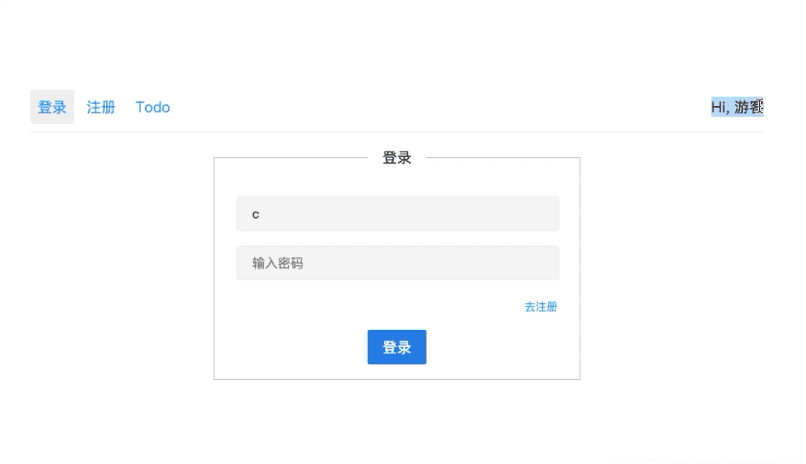
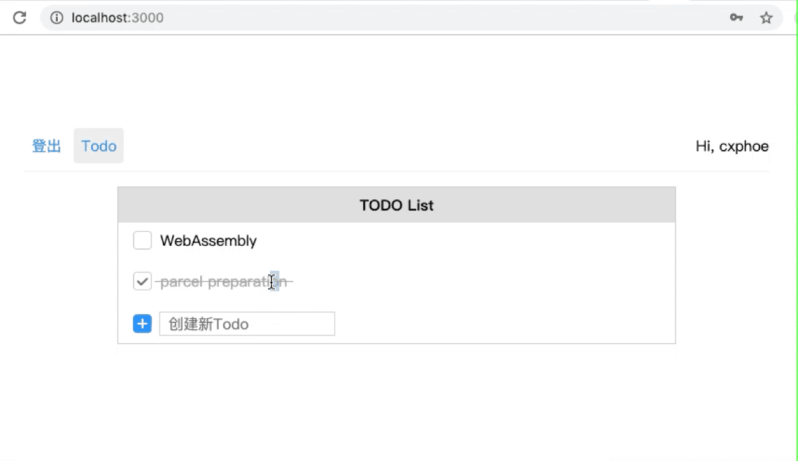

# web 框架 -- Python

> 基于 python socket 模块实现的 web 框架

- 通过底层 `socket` 监听端口得到的 `HTTP` 请求进行解析，处理，返回响应。框架实现了中间件机制。
- 采用 MVC 架构：
    - M: 实现了具备 CURD 操作 的 ORM，数据保存于本地文件
    - V: html 文件
    - C: 框架解析请求之后，会调用路由函数处理请求从而实现数据操作 / 返回视图
- 通过中间件机制实现 `静态文件访问` 以及 `csrf 验证`
- 实现了用户模块的基本功能（登录 \ 登出 \ 注册）
- 实现了 TODO 模块的增、删、改、查的功能（CURD）
- 前端通过 `ajax` 进行异步请求，实现数据的更新

## 登录/注册

## Todo 列表

## 开发

在目录底下，输入

    python app.py

即可在 `localhost:3000` 查看到页面效果
