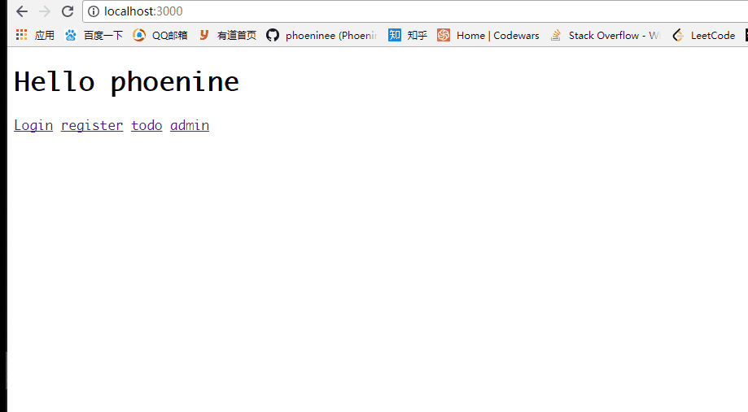

# web 框架

基于 `socket` 和 `HTTP` 协议，通过 `MVC` 实现的一个简单 web 框架：

- M: Mysql ORM
- V: templates html模板
- C: routes 路由函数

## 开发

需要在根目录下配置 config.py，包含以下数据：

    db_name: 要链接的 mysql 数据库中的 database 名字
    db_password: mysql 登陆密码

在目录底下，输入

    python server.py

即可在 `localhost:3000` 查看到页面效果